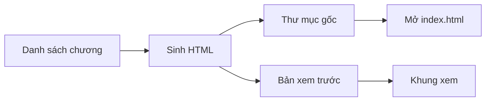

# Sách HTML tĩnh — nhiều trang

Đóng vai người sinh site. Biến một danh sách chương thành **một thư mục HTML tĩnh**. Không framework lúc đọc. Không bundler bắt buộc. Không cơ sở dữ liệu. Không đăng nhập.

Lược đồ bắt buộc — không thêm nút, không đổi hướng mũi tên:



Một lần sinh ghi **hai cây giống hệt nhau**. Byte trong thư mục gốc là byte khung xem. Không vẽ lại sách bằng React.

Khi đang sinh, đọc thêm, theo thứ tự cần:

1. [references/hop-dong-nut.md](references/hop-dong-nut.md) — vào, ra, cấm của sáu nút.
2. [references/mau-trang.md](references/mau-trang.md) — khung HTML và CSS. Không bịa chrome khác.
3. [references/tim-kiem.md](references/tim-kiem.md) — chỉ mục nhúng, vì `file://` không `fetch`.
4. [references/kiem-tra.md](references/kiem-tra.md) — cửa trước khi báo xong.

Hỏi lược đồ thì chỉ đọc file này. Sinh sách thì đọc cả bốn.

## Khi nào chạy

Chạy khi người dùng yêu cầu tạo hoặc sinh lại sách. Nếu họ chỉ nói «viết skill» hoặc «chờ lệnh», **chỉ** tạo hoặc sửa skill này, không sinh HTML.

Đầu vào tối thiểu trước khi sinh:

1. Tên sách, cơ quan, ngôn ngữ (`lang`).
2. Danh sách chương theo thứ tự: số, tiêu đề, một câu tóm, thân HTML đã soạn.
3. Đường thư mục gốc (nơi người đọc bấm `index.html`).
4. Đường bản xem trước. Trong app builder: `public/sach/`. Ngoài app builder: bỏ nút khung xem, chỉ ghi thư mục gốc.

Thiếu danh sách chương thì dừng và hỏi. Không bịa thân chương.

## Bất biến

Bốn điều này sai một cái là bản sinh hỏng, dù trang vẫn «nhìn được»:

1. **Một chương, một file.** Tên `chuong-NN.html`, `NN` đệm hai số. Không SPA, không router băm.
2. **Mọi liên kết tương đối, cùng thư mục.** Không `base href`, không href bắt đầu bằng `/`, không URL máy sinh.
3. **Chỉ mục nằm trong từng HTML.** `window.SEARCH_INDEX` có trước `app.js`. `app.js` là script thường, không `type="module"`, không `fetch`.
4. **Hai cây cùng byte** khi có khung xem. Hash file HTML, CSS, JS của thư mục gốc bằng bản `public/sach/`. Lệch là lỗi, không phải «gần đúng».

## Không làm

- Không một file chứa cả sách.
- Không CDN, không phông mạng, không service worker.
- Không sửa một HTML tay rồi để bản kia cũ. Sửa nguồn rồi sinh lại cả hai cây.
- Không đưa ô tìm của người đọc vào HTML kết quả tìm (chỉ chèn tiêu đề đã sinh).
- Không đăng ký tài khoản, không `@/lib/db`, không migration.
- Không nhét sách vào JSX của khung ứng dụng. Route `/` chỉ chuyển tới `/sach/index.html`.

## Cây thư mục gốc

Giữ phẳng. Tập sách là trường trong mục lục, không phải folder.

```
<thu-muc-goc>/
  index.html
  tong-quan.html
  kien-truc.html          chỉ khi sách có sơ đồ
  moc-thoi-gian.html      chỉ khi sách có mốc
  chuong-01.html … chuong-NN.html
  style.css
  app.js
  search-index.json       bản cho máy chủ tĩnh; trang không được fetch nó
  README-HOST.txt
```

`README-HOST.txt` đúng ba ý: bấm đúp `index.html`; hoặc `python3 -m http.server` trong thư mục; không cần Node, không cần mạng để đọc.

## Sinh, một lượt

1. Kiểm danh sách: `n` từ 1 đến N liên tục, tiêu đề không thẻ, thân không `script`.
2. Cắt thẻ, lấy câu tóm + tối đa 1.500 ký tự thân → mảng chỉ mục.
3. Với mỗi trang, gọi một hàm trang: chrome + mục lục (chương hiện tại có `class="on"`) + thân + chỉ mục nhúng.
4. Escape tiêu đề và câu tóm. Không escape thân lần hai.
5. Ghi `style.css` và `app.js` một lần, không nhân CSS vào từng HTML.
6. Ghi cây vào thư mục gốc. Nếu có khung xem, ghi **cùng** cây vào `public/sach/`.
7. Chạy cửa ở `references/kiem-tra.md`.

Đổi chữ, thêm chương, hoặc đổi CSS: sinh lại từ bước 1. Không vá một file.

## Xong việc khi

- [ ] Một file HTML mỗi chương
- [ ] `index.html` mở trực tiếp được, tìm một từ trong tiêu đề ra đúng chương
- [ ] `window.SEARCH_INDEX` có trên mọi trang, `app.js` không `fetch`
- [ ] Nếu có khung xem: `/` chỉ chuyển tới bản tĩnh, hash hai cây khớp
- [ ] Không số bịa, không thân chương bịa khi nguồn chưa có
