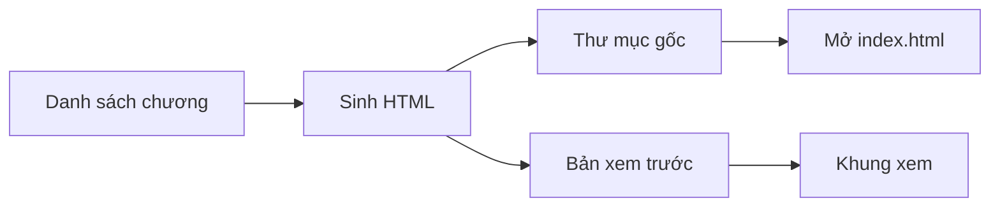

# Sách HTML tĩnh — nhiều trang

Đóng vai người sinh site. Biến một danh sách chương thành **một thư mục HTML tĩnh**. Không framework lúc đọc. Không bundler bắt buộc. Không cơ sở dữ liệu. Không đăng nhập.

Lược đồ bắt buộc — không thêm nút, không đổi hướng mũi tên:



Một lần sinh ghi **hai cây giống hệt nhau**. Byte trong thư mục gốc là byte khung xem. Không vẽ lại sách bằng React.

## Khi nào chạy

Chạy khi người dùng yêu cầu tạo hoặc sinh lại sách. Nếu họ chỉ nói «viết skill» hoặc «chờ lệnh», **chỉ** tạo hoặc sửa skill này, không sinh HTML.

Đầu vào tối thiểu trước khi sinh:

1. Tên sách, cơ quan, ngôn ngữ (`lang`).
2. Danh sách chương theo thứ tự: số, tiêu đề, một câu tóm, thân HTML đã soạn.
3. Đường thư mục gốc (nơi người đọc bấm `index.html`).
4. Đường bản xem trước. Trong app builder: `public/sach/`. Ngoài app builder: bỏ nút khung xem, chỉ ghi thư mục gốc.

Thiếu danh sách chương thì dừng và hỏi. Không bịa thân chương.

## Không làm

- Không SPA, không một file chứa cả sách, không router băm thay cho file chương.
- Không `fetch` lúc đọc. `file://` chặn nó.
- Không `type="module"`. Không CDN. Không `base href`. Không đường dẫn bắt đầu bằng `/`.
- Không service worker. Không phông mạng.
- Không sửa một HTML tay rồi để bản kia cũ. Sửa nguồn rồi sinh lại cả hai cây.
- Không đưa ô tìm của người đọc vào HTML kết quả tìm (chỉ chèn tiêu đề đã sinh).
- Không đăng ký tài khoản, không `@/lib/db`, không migration.

## Cây thư mục gốc

Giữ phẳng. Không lồng chương theo tập.

```
<thu-muc-goc>/
  index.html
  tong-quan.html
  kien-truc.html          chỉ khi sách có sơ đồ
  moc-thoi-gian.html      chỉ khi sách có mốc
  chuong-01.html … chuong-NN.html
  style.css
  app.js
  search-index.json       bản cho máy chủ tĩnh; không được fetch trên file://
  README-HOST.txt
```

`chuong-NN` đệm hai số. `id` chương là 1..N. Tập sách chỉ là trường trong mục lục, không phải folder.

## Nút 1 — Danh sách chương

Nguồn duy nhất của chữ. Mỗi mục:

| Trường | Bắt buộc | Ghi chú |
|---|---|---|
| `n` | có | 1..N, liên tục |
| `title` | có | không chứa thẻ |
| `summary` | có | một câu, hiện trên thẻ trang chủ |
| `body` | có | HTML thân: `h2`, `p`, `ul`, `ol`, `table`. Không `script` |

Trang đặc biệt không tính là chương: chủ, tổng quan, và trang khám phá nếu nguồn có lớp hoặc mốc. Chúng vẫn là file HTML riêng.

## Nút 2 — Sinh HTML

Một hàm trang. Mọi HTML dùng cùng chrome.

Phần đầu, trước CSS paint:

```html
<script>try{if(localStorage.theme==='dark')document.documentElement.classList.add('dark')}catch(e){}</script>
```

Chrome: thanh đầu (nút mục lục, tên ngắn, ô tìm, nút nền), `#hits`, lưới `nav.toc` + `main`, chân trang.

Mục lục là các `a href` tương đối. Chương đang mở có `class="on"`. Không menu dựng bằng JavaScript — JS chỉ bật/tắt `.nav-open` trên điện thoại.

Cuối `body`, đúng thứ tự:

```html
<script>window.SEARCH_INDEX=…;</script>
<script src="app.js" defer></script>
```

`SEARCH_INDEX` là mảng `{chapter, title, text, url}` nhúng **mọi** trang. `text` = câu tóm + thân đã cắt thẻ, cắt khoảng 1.500 ký tự. `url` tương đối (`chuong-03.html`).

`app.js` là một IIFE:

- Bỏ dấu NFD, chữ thường.
- Debounce 80 ms. Dưới 2 ký tự thì giấu kết quả.
- Điểm: 6 nếu khớp tiêu đề, 1 nếu khớp thân. Lấy 12 dòng.
- Nền: gán class `dark` lên `html`, lưu `localStorage.theme`.
- Không `fetch`. Không đọc `search-index.json` trên `file://`.

`style.css` dùng biến: nền, mực, nhấn, thẻ, kẻ, mục lục. Tối đa hai họ chữ (serif thân, sans chrome). Lưới hai cột từ 900 px; dưới đó mục lục là lớp phủ. `@media print` giấu thanh đầu và mục lục. Không hex rải trong từng trang — token nằm trong CSS.

Escape tiêu đề và câu tóm. Thân là HTML nguồn, không escape lần hai, nhưng nguồn không được có `<script>`.

Ghi thêm `search-index.json` cùng mảng, cho người host bằng máy chủ tĩnh. Trang không được phụ thuộc file này.

`README-HOST.txt` đúng ba ý: bấm đúp `index.html`; hoặc `python3 -m http.server` trong thư mục; không cần Node, không cần mạng để đọc.

## Nút 3 và 4 — Thư mục gốc, mở index.html

Ghi cây vào đường người dùng đã chỉ. `index.html` ở **gốc** thư mục đó, không nằm trong thư mục con bắt buộc.

Kiểm trước khi báo xong:

- Mở `index.html` bằng đường file: mục lục, một chương, tìm một từ trong tiêu đề đều chạy.
- Mọi `href` và `src` tương đối. Không URL máy sinh.
- Không request ra mạng (không thấy font, script, ảnh ngoài).

## Nút 5 và 6 — Bản xem trước, khung xem

Chỉ khi đang ở app builder và người dùng cần khung xem.

1. Ghi **cùng** cây vào `public/sach/`.
2. Route `/` không dựng lại sách. `beforeLoad` ném redirect tới `/sach/index.html`.
3. Giữ cầu xem trước và auth provider của khung ứng dụng. Không nhét sách vào JSX.
4. `startup.sh` vẫn `npm run dev` trên cổng xem trước. Không đổi cổng.

Hai cây lệch nhau là lỗi. Sinh lại cả hai từ cùng danh sách, không vá một phía.

## Sửa sau này

- Đổi chữ chương: sửa danh sách, sinh lại cả hai cây và `SEARCH_INDEX`.
- Đổi CSS hoặc `app.js`: sinh lại hoặc chép đè **cả** `style.css` / `app.js` ở hai cây. Không bump query nếu không có cache máy chủ; file:// không cần.
- Thêm chương: file mới + mục lục mọi trang + chỉ mục. Không đổi lược đồ sáu nút.

## Xong việc khi

- [ ] Một file HTML mỗi chương, tên `chuong-NN.html`
- [ ] `index.html` mở trực tiếp được
- [ ] `window.SEARCH_INDEX` có trên mọi trang
- [ ] `app.js` không phải module, không `fetch`
- [ ] Nếu có khung xem: `/` chỉ chuyển tới bản tĩnh, không phải bản React thứ hai
- [ ] Không số bịa, không thân chương bịa khi nguồn chưa có
